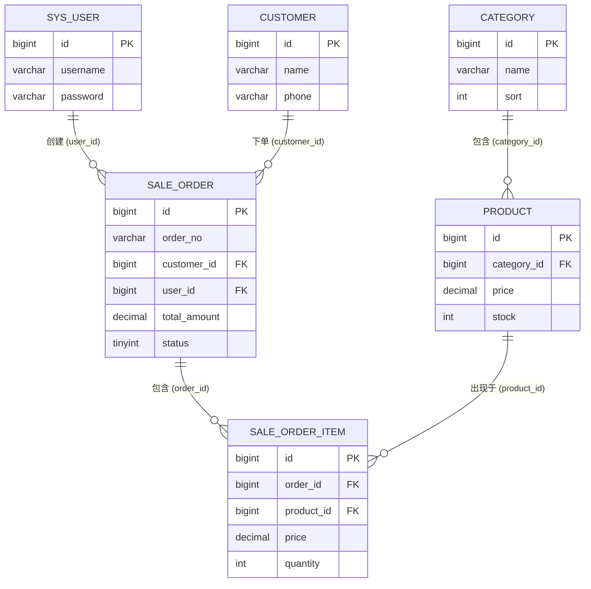
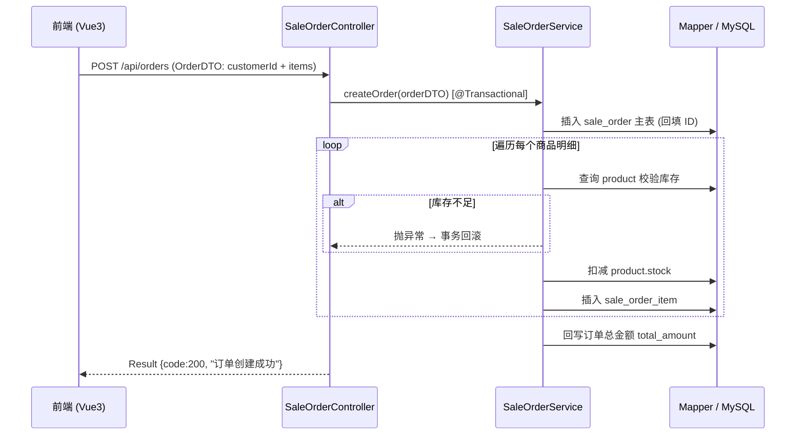

# 08_进销存系统_项目架构图

本架构图根据 docs 目录下 7 篇文档(01~07)整理生成,描述硅谷进销存 (Lite-IMS) 的整体技术架构。

## 一、整体架构图

```mermaid
graph TD
    subgraph FE["前端 · Vue 3 + Vite (localhost:5173)"]
        V[页面视图<br/>Login / Dashboard / Category / Product / Customer / Order]
        EP[Element Plus<br/>UI 组件库]
        VR[Vue Router 4<br/>前端路由]
        AX[Axios 实例<br/>统一请求/响应拦截]
        V --> VR
        V --> EP
        V --> AX
    end

    AX -- "RESTful JSON · /api/**" --> IC

    subgraph BE["后端 · Spring Boot (localhost:8080)"]
        IC[LoginInterceptor<br/>Session 登录校验]
        LOG[LogAspect<br/>AOP 请求日志/耗时]
        K4J[Knife4j 接口文档<br/>doc.html]

        IC --> C

        C["Controller 层<br/>Login / Dashboard / Category / Product / Customer / SaleOrder / Excel"]
        S["Service 层<br/>业务逻辑 · @Transactional 事务 · 库存扣减"]
        M["Mapper 层<br/>MyBatis-Plus BaseMapper + XML 关联查询"]

        C --> S --> M

        TASK[StockTask<br/>@Scheduled 定时库存预警]
        COMMON[公共组件<br/>Result / DTO / VO]
        CONF[配置类<br/>MybatisPlusConfig 分页 · WebConfig]

        TASK -.-> M
        LOG -.切面拦截.-> C
    end

    M -- "JDBC · MySQL Connector/J" --> DB[("MySQL 8.0<br/>lite_ims")]
```

## 二、数据库 E-R 图



## 三、核心业务流程(创建订单)



## 四、技术栈速查

| 层 | 技术 | 说明 |
| :--- | :--- | :--- |
| 前端 | Vue 3 + Vite + Element Plus + Vue Router 4 + Axios | 端口 5173 |
| 后端 | Spring Boot + MyBatis-Plus + Lombok + Knife4j + Spring AOP + Spring Task + EasyExcel | 端口 8080 |
| 数据库 | MySQL 8.0,库名 `lite_ims`(脚本 `mysql/lite_ims.sql`) | 6 张表,统一逻辑删除 `is_deleted` |
| 接口规范 | RESTful + 统一返回 `Result<T>`(code/message/data) | 文档地址 `http://localhost:8080/doc.html` |
